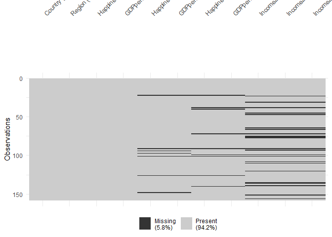
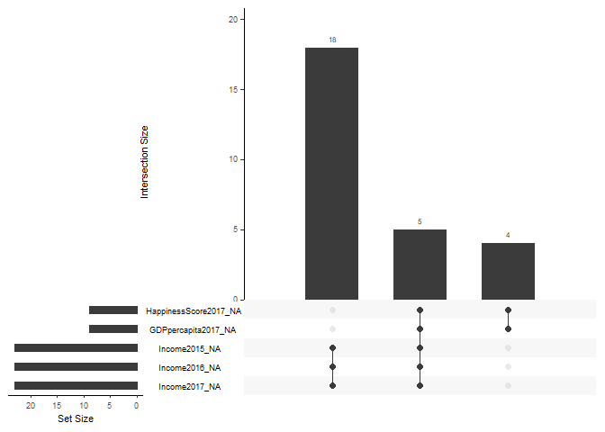
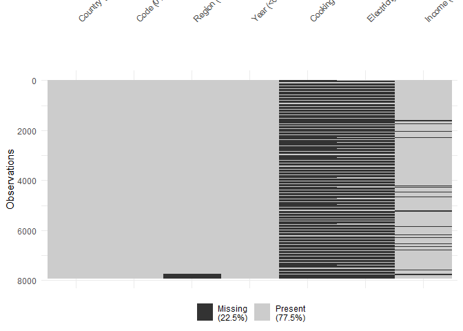
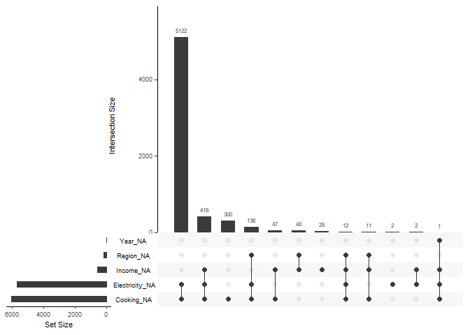

<!-- README.md is generated from README.Rmd. Please edit that file -->

# drone: **D**ata fo**R** ge**O**m e**N**cyclopa**E**dia

<!-- badges: start -->

<!-- badges: end -->

This package serves as a companion to the [Data Visualization Geometries
Encyclopedia](https://thiyangt.github.io/geom.encyclopedia/) by
[Thiyanga S. Talagala](https://thiyanga.netlify.app/)

# Installation

You can install the development version of drone from
[GitHub](https://github.com/) with:

``` r
# install.packages("devtools")
devtools::install_github("thiyangt/drone")
```

# Datasets

Load datasets related to the Encyclopedia

``` r
library(drone)
library(visdat)
library(naniar)
```

## `happiness_gdp_income`

``` r
library(tibble)
data("happiness_gdp_income")
happiness_gdp_income
#> # A tibble: 158 × 11
#>    Country     Region     HappinessScore2015 GDPpercapita2015 HappinessScore2016
#>    <chr>       <chr>                   <dbl>            <dbl>              <dbl>
#>  1 Switzerland Western E…               7.59             1.40               7.51
#>  2 Iceland     Western E…               7.56             1.30               7.50
#>  3 Denmark     Western E…               7.53             1.33               7.53
#>  4 Norway      Western E…               7.52             1.46               7.50
#>  5 Canada      North Ame…               7.43             1.33               7.40
#>  6 Finland     Western E…               7.41             1.29               7.41
#>  7 Netherlands Western E…               7.38             1.33               7.34
#>  8 Sweden      Western E…               7.36             1.33               7.29
#>  9 New Zealand Australia…               7.29             1.25               7.33
#> 10 Australia   Australia…               7.28             1.33               7.31
#> # ℹ 148 more rows
#> # ℹ 6 more variables: GDPpercapita2016 <dbl>, HappinessScore2017 <dbl>,
#> #   GDPpercapita2017 <dbl>, Income2015 <fct>, Income2016 <fct>,
#> #   Income2017 <fct>
```

``` r
vis_dat(happiness_gdp_income)
```


``` r
vis_miss(happiness_gdp_income)
```



``` r
gg_miss_upset(happiness_gdp_income)
```



## `worldbankdata`

``` r
data("worldbankdata")
worldbankdata
#> # A tibble: 7,937 × 7
#>    Country Code  Region                     Year Cooking Electricity Income
#>    <fct>   <fct> <fct>                     <dbl>   <dbl>       <dbl> <fct> 
#>  1 Aruba   ABW   Latin America & Caribbean  1990      NA       100   H     
#>  2 Aruba   ABW   Latin America & Caribbean  2000      NA        91.7 H     
#>  3 Aruba   ABW   Latin America & Caribbean  2013      NA       100   H     
#>  4 Aruba   ABW   Latin America & Caribbean  2014      NA       100   H     
#>  5 Aruba   ABW   Latin America & Caribbean  2015      NA       100   H     
#>  6 Aruba   ABW   Latin America & Caribbean  2016      NA       100   H     
#>  7 Aruba   ABW   Latin America & Caribbean  2017      NA       100   H     
#>  8 Aruba   ABW   Latin America & Caribbean  2018      NA       100   H     
#>  9 Aruba   ABW   Latin America & Caribbean  2019      NA       100   H     
#> 10 Aruba   ABW   Latin America & Caribbean  2020      NA       100   H     
#> # ℹ 7,927 more rows
```

``` r
vis_dat(worldbankdata)
```


``` r
vis_miss(worldbankdata)
```



``` r
gg_miss_upset(worldbankdata)
```



### Extract geoms

``` r
library(ggplot2)
drone::extract_geoms(ggplot2, "^geom_s")
#> [1] "geom_segment"  "geom_sf"       "geom_sf_label" "geom_sf_text" 
#> [5] "geom_smooth"   "geom_spoke"    "geom_step"
```
