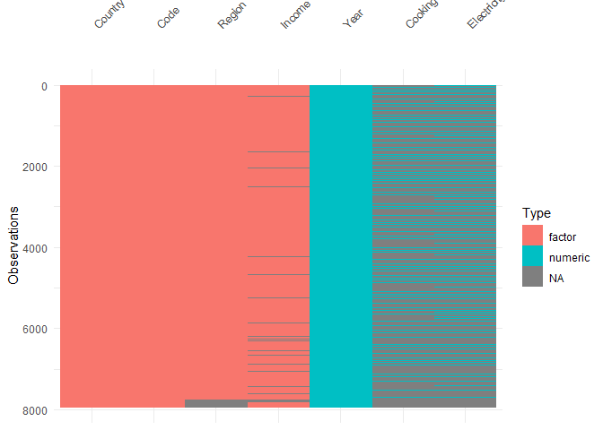

<!-- README.md is generated from README.Rmd. Please edit that file -->

# drone: **D**ata fo**R** ge**O**m e**N**cyclopa**E**dia

<!-- badges: start -->

<!-- badges: end -->

This package serves as a companion to the [Data Visualization Geometries
Encyclopedia](https://thiyangt.github.io/geom.encyclopedia/) by
[Thiyanga S. Talagala](https://thiyanga.netlify.app/)

## Installation

You can install the development version of drone from
[GitHub](https://github.com/) with:

``` r
# install.packages("devtools")
devtools::install_github("thiyangt/drone")
```

## Dataset

Load datasets related to the Encyclopedia

``` r
library(drone)
```

``` r
library(tibble)
data("WorldHappinessScore")
WorldHappinessScore
#> # A tibble: 145 × 5
#>    flagCode country     WorldHappinessScore_2024 WorldHappinessScore_2023
#>    <chr>    <chr>                          <dbl>                    <dbl>
#>  1 FI       Finland                         7.74                     7.80
#>  2 DK       Denmark                         7.58                     7.59
#>  3 IS       Iceland                         7.53                     7.53
#>  4 SE       Sweden                          7.34                     7.40
#>  5 IL       Israel                          7.34                     7.47
#>  6 NL       Netherlands                     7.32                     7.40
#>  7 NO       Norway                          7.3                      7.32
#>  8 LU       Luxembourg                      7.12                     7.23
#>  9 AU       Australia                       7.06                     7.10
#> 10 CH       Switzerland                     7.06                     7.24
#> # ℹ 135 more rows
#> # ℹ 1 more variable: WorldHappinessScore_2022 <dbl>
```

``` r
data("worldbankdata")
worldbankdata
#> # A tibble: 7,937 × 7
#>    Country Code  Region                     Year Cooking Electricity Income
#>    <fct>   <fct> <fct>                     <dbl>   <dbl>       <dbl> <fct> 
#>  1 Aruba   ABW   Latin America & Caribbean  1990      NA       100   H     
#>  2 Aruba   ABW   Latin America & Caribbean  2000      NA        91.7 H     
#>  3 Aruba   ABW   Latin America & Caribbean  2013      NA       100   H     
#>  4 Aruba   ABW   Latin America & Caribbean  2014      NA       100   H     
#>  5 Aruba   ABW   Latin America & Caribbean  2015      NA       100   H     
#>  6 Aruba   ABW   Latin America & Caribbean  2016      NA       100   H     
#>  7 Aruba   ABW   Latin America & Caribbean  2017      NA       100   H     
#>  8 Aruba   ABW   Latin America & Caribbean  2018      NA       100   H     
#>  9 Aruba   ABW   Latin America & Caribbean  2019      NA       100   H     
#> 10 Aruba   ABW   Latin America & Caribbean  2020      NA       100   H     
#> # ℹ 7,927 more rows
```

``` r
library(visdat)
vis_dat(worldbankdata)
```



``` r
vis_miss(worldbankdata)
```


``` r
library(naniar)
gg_miss_upset(worldbankdata)
```


### Extract geoms

``` r
library(ggplot2)
drone::extract_geoms(ggplot2, "^geom_s")
#> [1] "geom_segment"  "geom_sf"       "geom_sf_label" "geom_sf_text" 
#> [5] "geom_smooth"   "geom_spoke"    "geom_step"
```
