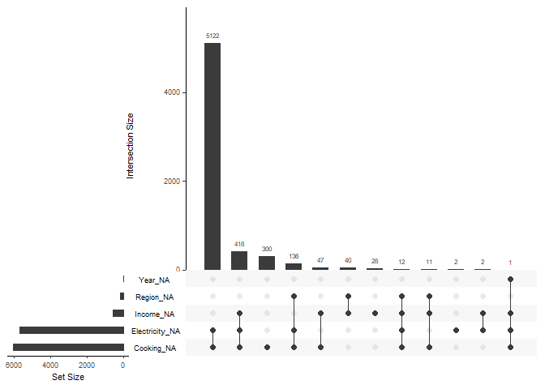

<!-- README.md is generated from README.Rmd. Please edit that file -->

# drone: **D**ata fo**R** ge**O**m e**N**cyclopa**E**dia

<!-- badges: start -->
<!-- badges: end -->

This package serves as a companion to the [Data Visualization Geometries
Encyclopedia](https://thiyangt.github.io/geom.encyclopedia/) by
[Thiyanga S. Talagala](https://thiyanga.netlify.app/)

## Installation

You can install the development version of drone from
[GitHub](https://github.com/) with:

``` r
# install.packages("devtools")
devtools::install_github("thiyangt/drone")
```

## Example

Load datasets related to the Encyclopedia

``` r
library(drone)
```

``` r
library(tibble)
data("worldbankdata")
worldbankdata
#> # A tibble: 7,937 × 7
#>    Country Code  Region                     Year Cooking Electricity Income
#>    <fct>   <fct> <fct>                     <dbl>   <dbl>       <dbl> <fct> 
#>  1 Aruba   ABW   Latin America & Caribbean  1990      NA       100   H     
#>  2 Aruba   ABW   Latin America & Caribbean  2000      NA        91.7 H     
#>  3 Aruba   ABW   Latin America & Caribbean  2013      NA       100   H     
#>  4 Aruba   ABW   Latin America & Caribbean  2014      NA       100   H     
#>  5 Aruba   ABW   Latin America & Caribbean  2015      NA       100   H     
#>  6 Aruba   ABW   Latin America & Caribbean  2016      NA       100   H     
#>  7 Aruba   ABW   Latin America & Caribbean  2017      NA       100   H     
#>  8 Aruba   ABW   Latin America & Caribbean  2018      NA       100   H     
#>  9 Aruba   ABW   Latin America & Caribbean  2019      NA       100   H     
#> 10 Aruba   ABW   Latin America & Caribbean  2020      NA       100   H     
#> # ℹ 7,927 more rows
```

``` r
library(visdat)
vis_dat(worldbankdata)
```


``` r
vis_miss(worldbankdata)
```


``` r
library(naniar)
gg_miss_upset(worldbankdata)
```


